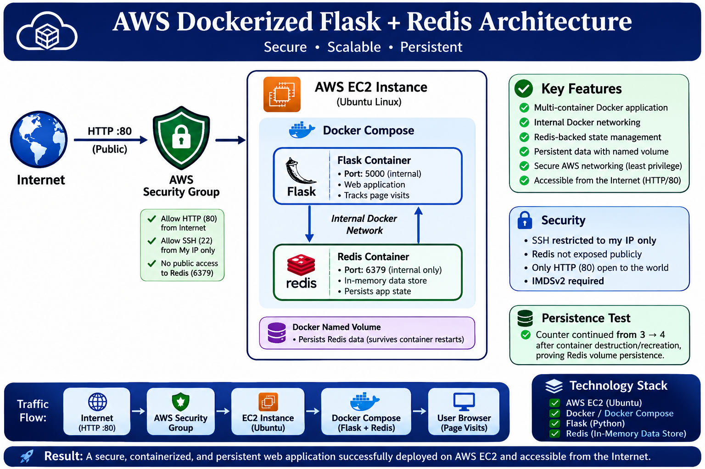
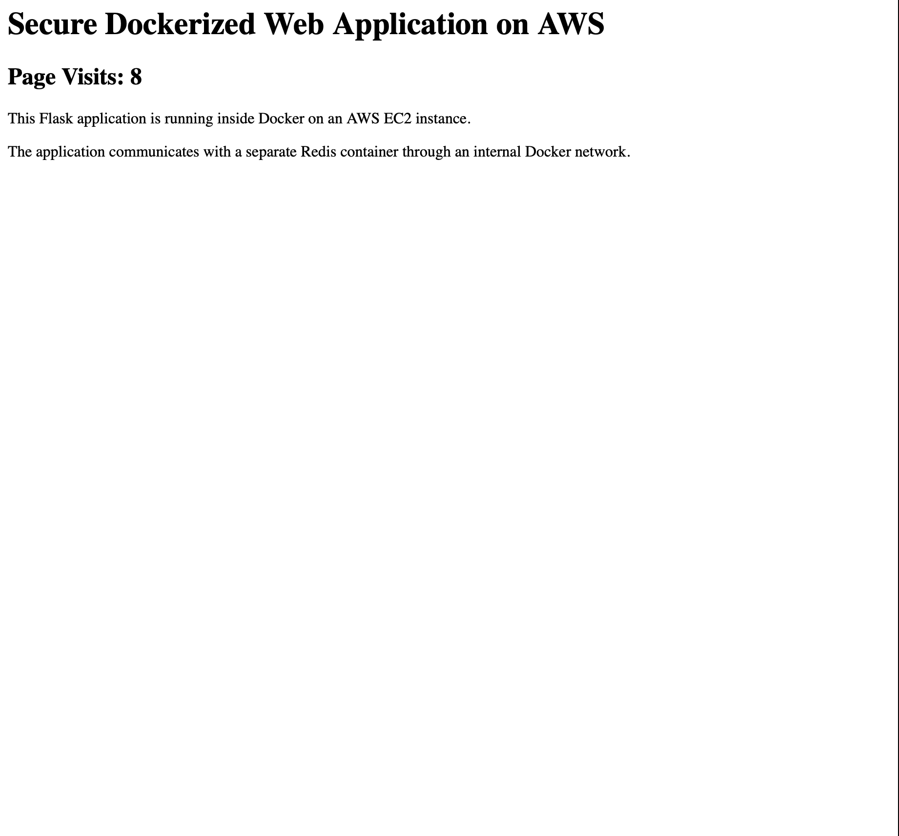
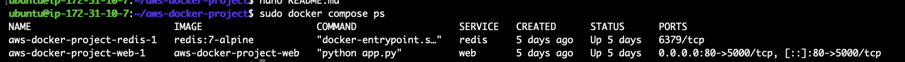
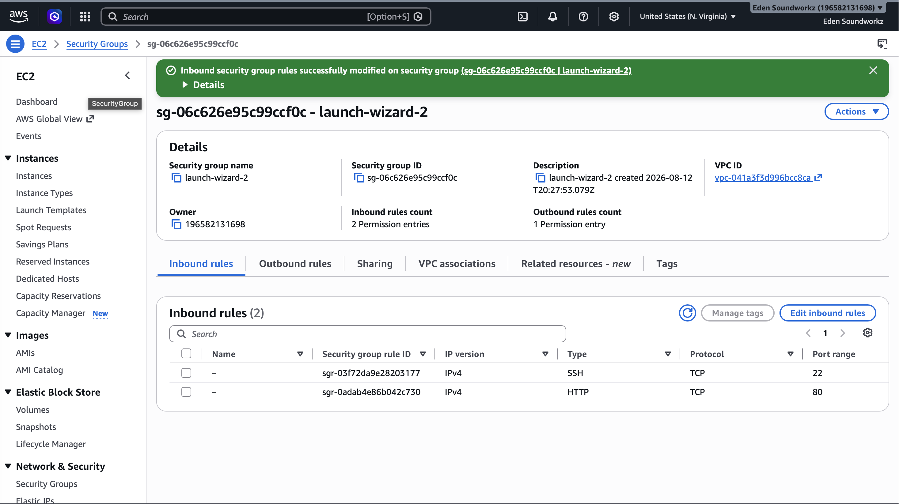

# AWS Dockerized Flask + Redis Web Application

A secure, multi-container web application deployed on AWS EC2 using Docker Compose. The project demonstrates containerization, cloud deployment, internal service networking, persistent Redis storage, Linux administration, and AWS security configuration.

## Project Overview

This project deploys a Python Flask web application and Redis database as separate Docker containers on an Ubuntu EC2 instance.

The Flask application displays a page-visit counter. Each request increments the counter stored in Redis.

Docker Compose manages both services and provides an internal Docker network that allows Flask to communicate with Redis without exposing Redis directly to the Internet.

A named Docker volume provides persistent Redis storage, allowing the page counter to survive container destruction and recreation.

## Architecture

Traffic follows this path:

Internet
→ AWS Security Group
→ EC2 Ubuntu Server
→ Docker Compose
→ Flask Container
→ Internal Docker Network
→ Redis Container
→ Persistent Docker Volume

### Network Flow

- HTTP traffic enters the EC2 instance through TCP port 80.
- Docker maps host port 80 to Flask container port 5000.
- Flask communicates with Redis through Docker's internal network.
- Redis listens internally on TCP port 6379.
- Redis port 6379 is not exposed publicly.
- Redis data is stored in a persistent named Docker volume.

## Technology Stack

- AWS EC2
- Ubuntu Linux
- Docker
- Docker Compose
- Python
- Flask
- Redis
- Git
- GitHub

## Container Architecture

The application consists of two services.

### Web Container

The Flask container:

- Runs the Python web application
- Listens internally on port 5000
- Receives public HTTP traffic through port 80 on the EC2 host
- Connects to Redis using the Docker service name `redis`

### Redis Container

The Redis container:

- Uses the `redis:7-alpine` image
- Listens internally on port 6379
- Stores the page-visit counter
- Is accessible by Flask through the internal Docker network
- Is not directly exposed to the Internet

## Persistent Storage

Redis uses a named Docker volume:

`redis-data`

This allows application state to survive container recreation.

Persistence was tested by incrementing the application counter:

1 → 2 → 3

The Docker containers were then destroyed and recreated.

After recreation, the next request returned:

4

This confirmed that Redis data persisted independently of the container lifecycle.

## AWS Security Configuration

The EC2 Security Group follows a least-privilege approach.

### HTTP

TCP port 80 is publicly accessible so users can reach the web application.

### SSH

TCP port 22 is restricted to the administrator's IP address rather than being exposed to the entire Internet.

### Redis

TCP port 6379 is not exposed through the AWS Security Group.

Redis communication occurs only through Docker's internal network.

### EC2 Metadata Security

The EC2 instance requires IMDSv2 for instance metadata access.

## Deployment

The application is deployed using Docker Compose:

```bash
sudo docker compose up -d --build
sudo docker compose ps
```

The deployment runs two containers:

- Flask web application
- Redis data store

## Testing

The application was first tested locally from the EC2 instance:

```bash
curl http://localhost
```

Repeated requests confirmed that Redis correctly incremented the page counter.

The application was then accessed from an external browser using the EC2 public endpoint, confirming successful Internet-to-application connectivity.

## Troubleshooting

During deployment, Docker initially failed to build the Flask image because the application file had accidentally been created as:

` app.py`

instead of:

`app.py`

This caused the Dockerfile instruction:

```dockerfile
COPY app.py .
```

to fail.

The filename was corrected and the Docker image successfully rebuilt.

A Docker Compose YAML structure issue was also identified and corrected before redeploying the application.

These issues provided practical experience troubleshooting:

- Linux filenames
- Docker build contexts
- Dockerfile COPY operations
- YAML structure
- Docker Compose validation
- Container networking

## Results

The completed deployment demonstrates:

- AWS EC2 cloud deployment
- Linux server administration
- Multi-container Docker architecture
- Docker Compose orchestration
- Flask-to-Redis communication
- Internal container networking
- Persistent application state
- AWS Security Group configuration
- Public web application deployment
- Git and GitHub version control
- Docker troubleshooting

## What I Learned

This project strengthened my understanding of how multiple cloud and DevOps technologies work together as one system.

Rather than simply launching an EC2 instance, I configured the server, installed Docker, containerized an application, orchestrated multiple services, configured internal networking, implemented persistent storage, secured network access, tested the application, troubleshot deployment problems, and version-controlled the final project.

The project also demonstrated why application containers should remain disposable while important application data is stored separately using persistent volumes.

## Screenshots

Project screenshots and the architecture diagram are stored in the `screenshots/` directory.

### Architecture Diagram



### Live Application



### Running Containers



### AWS Security Configuration



## Author

**Prescott Narcisse**

Cloud / IT Infrastructure Portfolio Project
